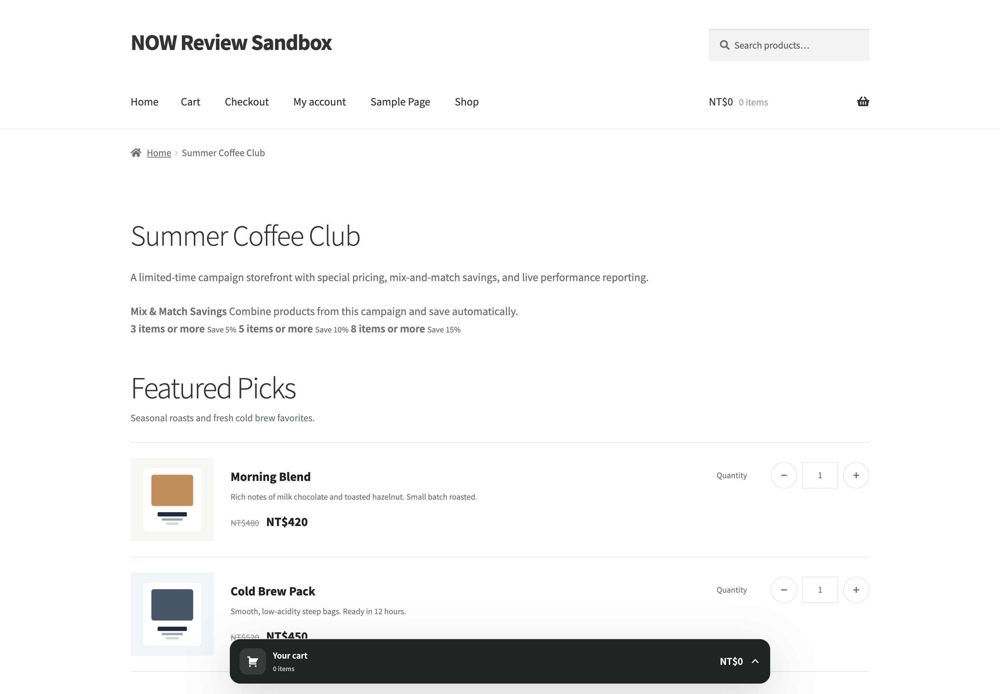
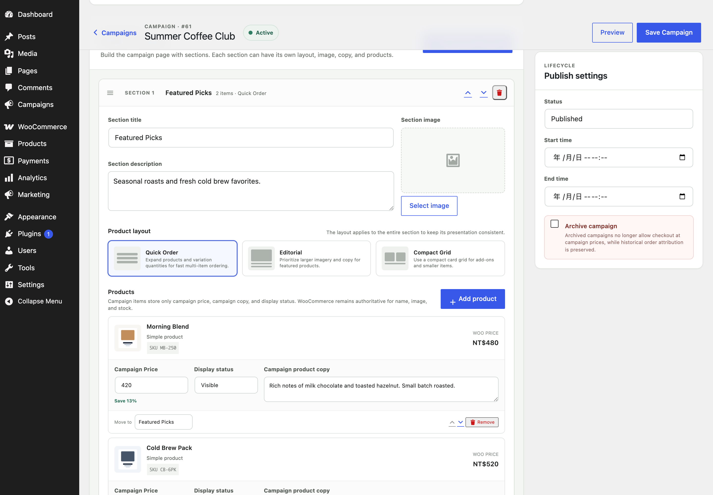
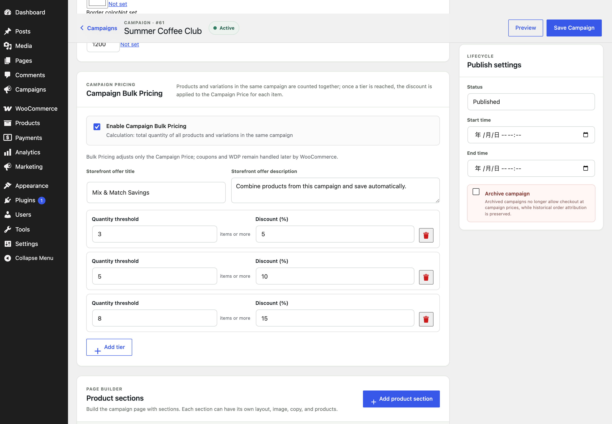
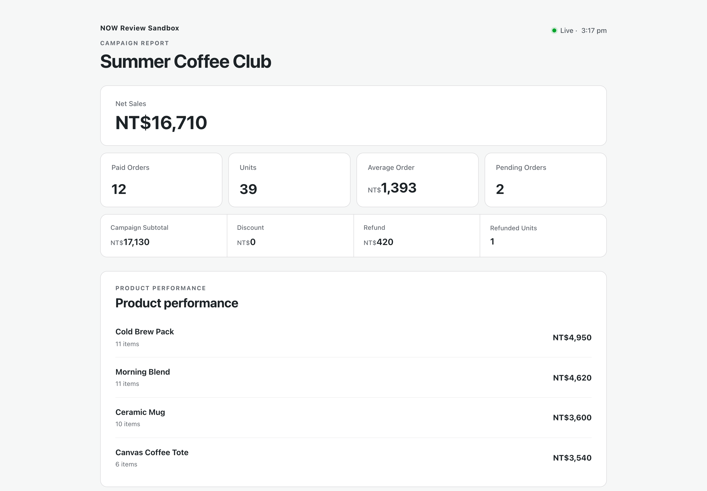

# NOW Campaign Storefronts for WooCommerce

[繁體中文 README](README.zh-TW.md)

NOW Campaign Storefronts for WooCommerce adds campaign-specific storefronts, pricing, attribution, and live reporting without replacing WooCommerce products, inventory, carts, orders, refunds, or discounts.

NOW Campaign Storefronts is an independent open-source project and is not an official WooCommerce or Automattic product.

## Features

- Campaign pricing for WooCommerce simple products and variations.
- Campaign-wide mix-and-match Bulk Pricing tiers based on total eligible Campaign quantity.
- Quick Order, Editorial, and Compact campaign layouts.
- Campaign sections, image galleries, rich content, and shortcode support.
- WooCommerce cart/session integration and Classic Checkout compatibility.
- Order-item campaign attribution with HPOS support.
- Refund-aware campaign reporting.
- Password-protected live report links with product performance metrics.
- Theme-aware presentation with isolated campaign commerce controls.

Campaign Bulk Pricing is a quantity-dependent Campaign Price, not a second discount engine. Eligible products and variations in the same Campaign are counted together; the highest reached tier adjusts each item from its own Campaign Price before WooCommerce coupons or compatible dynamic-pricing rules continue through the normal WooCommerce flow.

## Screenshots

### Campaign Storefront


### Campaign Editor


### Campaign Bulk Pricing


### Live Campaign Report



## Requirements

- WordPress 6.5 or newer.
- WooCommerce 8.0 or newer.
- PHP 8.1 or newer.

The current public release candidate is tested with WordPress 7.0 and WooCommerce 10.9.

## Architecture

NOW Campaign Storefronts deliberately keeps WooCommerce authoritative for commerce data:

```text
WooCommerce Product / Variation = Product authority
WooCommerce Inventory           = Inventory authority
WooCommerce Cart / Session      = Cart authority
WooCommerce Coupon / Pricing    = Discount authority
WooCommerce Order / Refund      = Financial authority

NOW Campaign Storefronts = campaign context + campaign price + attribution + reporting + presentation
```

## Installation

1. Install and activate WooCommerce.
2. Install and activate NOW Campaign Storefronts for WooCommerce.
3. Open the Campaigns screen in WordPress admin.
4. Create a campaign and add products or variations.
5. Set Campaign Prices and, optionally, Campaign Bulk Pricing quantity tiers.
6. Configure content and presentation, then publish.

## Development

The plugin uses a PSR-4-style `Bboyfan\NowCampaignStorefronts\` namespace and includes a runtime fallback autoloader. `composer.json` is included so the source can be inspected and worked on with Composer-based tooling.

Before submitting changes, run PHP syntax checks and JavaScript syntax checks and verify Campaign Price, Bulk Pricing, attribution, reporting, refunds, and storefront behavior against WooCommerce.

The CSS distributed with the plugin is the project's source CSS; it is not generated from a separate proprietary stylesheet source.

## WordPress.org release

The private development source keeps its existing internal identifiers. `scripts/build-wordpress-org.sh` creates the WordPress.org-ready package using the public identity `NOW Campaign Storefronts for WooCommerce`, slug `now-campaign-storefronts`, main file `now-campaign-storefronts.php`, and text domain `now-campaign-storefronts` without changing runtime class names, database identifiers, CSS classes, or option/meta prefixes.

The WordPress.org package uses English canonical source strings. WordPress.org supplies translation language packs; no translation binaries are bundled in the ZIP.

## Security

Please do not report security vulnerabilities in a public issue. See [SECURITY.md](SECURITY.md).

## Contributing

See [CONTRIBUTING.md](CONTRIBUTING.md).

## License

GPL-2.0-or-later. See [LICENSE](LICENSE).
